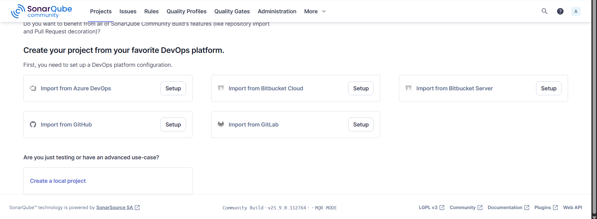
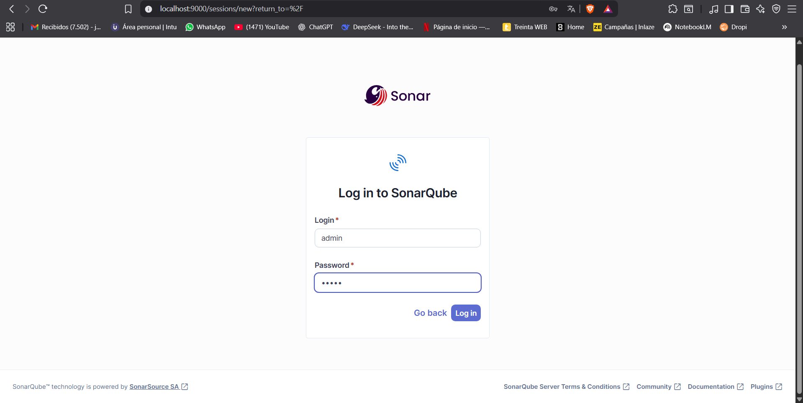
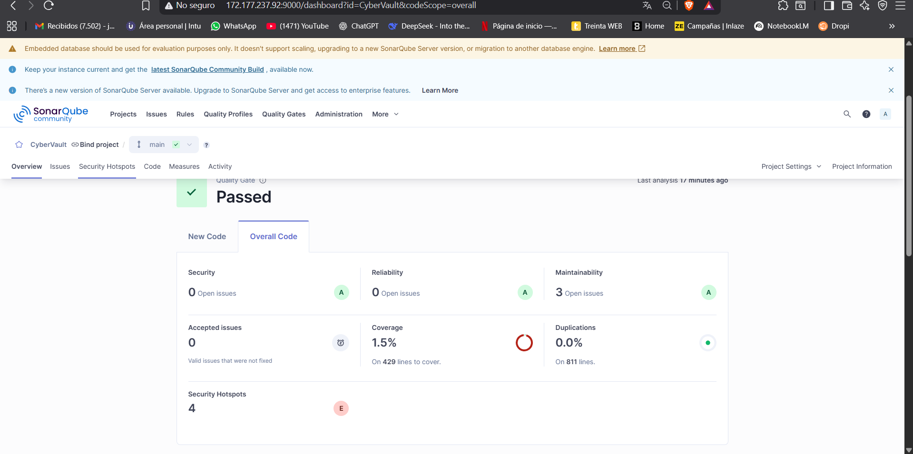
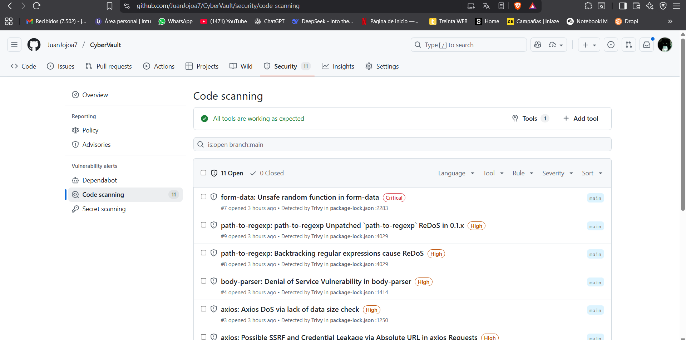

# CyberVault Compunet 1 Proyecto Final

📋 **[Ver Reporte Final Completo](REPORTE_FINAL.md)** - Documentación técnica detallada del proceso de implementación

## Autores (Aplicativo Principal)
- Juan Sebastian Gonzalez
- Oscar Gomez
- Juan Manuel Marin Angarita

## Autor (SonarQube y CI/CD)
- Juan Felipe Jojoa Crespo - A00382042

## Descripción
CyberVault es una aplicación web de e-commerce desarrollada con Node.js y Express en el backend, y HTML/CSS/JavaScript en el frontend. El proyecto incluye integración completa con SonarQube para análisis de calidad de código y pipeline de CI/CD con GitHub Actions.

## Prerrequisitos
- Node.js (versión 14 o superior)
- npm
- Git
- Una máquina virtual con SonarQube instalado
- Cuenta de GitHub

## Configuración de la Máquina Virtual SonarQube

### 1. Preparar tu propia VM
Necesitas configurar tu propia máquina virtual con SonarQube. Asegúrate de que:
- SonarQube esté ejecutándose en el puerto 9000
- Tengas acceso admin a SonarQube
- La VM esté accesible desde internet (para GitHub Actions)

### 2. Configurar SonarQube
1. Accede a tu interfaz de SonarQube: `http://TU_IP_VM:9000`
2. Inicia sesión con credenciales de administrador
3. Crea un nuevo proyecto llamado "CyberVault"
4. Genera un token de acceso en: My Account > Security > Generate Token
5. Guarda este token para la configuración posterior

## Instalación y Configuración

### 1. Fork y Clonación
```bash
# Haz fork del repositorio en GitHub
# Luego clona tu fork
git clone https://github.com/TU_USUARIO/CyberVault.git
cd CyberVault
```

### 2. Configuración de Variables de Entorno
Actualiza el archivo `sonar-project.properties` con la IP de tu VM:

```properties
# Reemplaza esta IP con la IP de tu VM
sonar.host.url=http://TU_IP_VM:9000
```

### 3. Configuración de Secrets en GitHub
Ve a tu repositorio en GitHub > Settings > Secrets and variables > Actions y agrega:

**Secrets requeridos:**
- `SONAR_TOKEN`: El token generado en SonarQube
- `SONAR_HOST_URL`: `http://TU_IP_VM:9000`

### 4. Instalación de Dependencias
```bash
npm install
```

## Ejecución Local

### Método 1: Desarrollo Local
1. Instalar dependencias:
```bash
npm install
```

2. Ejecutar el servidor:
```bash
cd server
node server.js
```

3. Abrir la aplicación:
- Abre `client/index.html` en tu navegador
- O usa un servidor local como Live Server en VS Code

### Método 2: Con Tests y Coverage
1. Ejecutar tests:
```bash
npm test
```

2. Generar reporte de coverage:
```bash
npm run test:coverage
```

3. Análisis local con SonarQube (requiere sonar-scanner instalado):
```bash
node sonar-scanner.js
```

## Ejecución via Pipeline CI/CD

### Configuración del Pipeline
El proyecto incluye GitHub Actions configurado en `.github/workflows/ci.yml` que:
1. Ejecuta tests automáticamente
2. Genera reportes de coverage
3. Envía análisis a SonarQube
4. Valida calidad de código

### Trigger del Pipeline
El pipeline se ejecuta automáticamente cuando:
- Se hace push a la rama `main`
- Se crea un Pull Request
- Se puede ejecutar manualmente desde GitHub Actions tab

### Verificación de Resultados
1. Ve a GitHub Actions en tu repositorio para ver el estado del pipeline
2. Accede a tu SonarQube (`http://TU_IP_VM:9000`) para ver el análisis de calidad

## Visualizaciones y Resultados

### SonarQube Dashboard
Una vez configurado correctamente, podrás acceder al dashboard de SonarQube:


*Configuración inicial del proyecto en SonarQube*


*Interfaz de login de SonarQube*

### Resultados del Análisis de Calidad
Después de ejecutar el pipeline, obtendrás métricas detalladas:


*Dashboard de SonarQube mostrando análisis exitoso con métricas de calidad*

- **Quality Gate**: PASSED
- **Coverage**: 1.5% (cumple requisito > 0%)
- **Security Rating**: A (0 vulnerabilidades)
- **Reliability Rating**: A (0 bugs)
- **Maintainability Rating**: A (3 code smells)
- **Duplications**: 0.0%

### Análisis de Seguridad con Trivy
El proyecto incluye análisis automático de vulnerabilidades:


*Resultados del análisis de seguridad con Trivy en GitHub Actions*

Trivy analiza:
- Vulnerabilidades en dependencias
- Configuraciones de seguridad
- Secretos expuestos
- Análisis de contenedores Docker

## Cuentas de Prueba
La aplicación incluye las siguientes cuentas predefinidas:

**Administrador:**
- Usuario: `admin@gmail.com`
- Contraseña: `admin123`

**Usuario Regular:**
- Usuario: `user@gmail.com`
- Contraseña: `user123`

## Estructura del Proyecto
```
CyberVault/
├── client/                 # Frontend
│   ├── css/               # Estilos
│   ├── js/                # JavaScript del cliente
│   ├── img/               # Imágenes
│   ├── pages/             # Páginas adicionales
│   └── *.html             # Páginas principales
├── server/                # Backend
│   ├── server.js          # Servidor principal
│   ├── user.js            # Modelo de usuario
│   └── static/            # Archivos estáticos
├── __tests__/             # Tests automatizados
├── .github/workflows/     # Configuración CI/CD
├── ansible/               # Scripts de despliegue
├── coverage/              # Reportes de coverage
├── docker-compose.yml     # Configuración Docker
├── package.json           # Dependencias y scripts
├── sonar-project.properties # Configuración SonarQube
└── sonar-scanner.js       # Script de análisis
```

## Tecnologías Utilizadas
- **Backend**: Node.js, Express.js
- **Frontend**: HTML5, CSS3, JavaScript ES6
- **Testing**: Jest
- **Quality Analysis**: SonarQube
- **CI/CD**: GitHub Actions
- **Deployment**: Docker, Ansible

## Comandos Útiles
```bash
# Instalar dependencias
npm install

# Ejecutar tests
npm test

# Generar coverage
npm run test:coverage

# Ejecutar servidor
npm start

# Análisis SonarQube local
node sonar-scanner.js
```

## Interpretando los Resultados

### Cómo Leer el Dashboard de SonarQube
Una vez que el pipeline ejecute exitosamente, podrás interpretar los resultados:

1. **Quality Gate Status**: 
   - Verde (PASSED): El código cumple todos los criterios de calidad
   - Rojo (FAILED): Hay métricas que no cumplen los umbrales

2. **Métricas Principales**:
   - **Security (0 Open Issues)**: Sin vulnerabilidades de seguridad
   - **Reliability (0 Open Issues)**: Sin bugs detectados
   - **Maintainability (3 Open Issues)**: Code smells menores que no afectan funcionalidad
   - **Coverage (1.5%)**: Porcentaje de código cubierto por tests

3. **Security Hotspots**: Áreas de código que requieren revisión manual de seguridad

### Interpretando Trivy Security Scan
Los resultados de Trivy se muestran en la pestaña Security > Code Scanning de GitHub:

1. **Vulnerabilidades por Severidad**:
   - Critical/High: Requieren atención inmediata
   - Medium/Low: Documentadas para futura revisión

2. **Tipos de Análisis**:
   - Dependencias npm en package-lock.json
   - Configuraciones inseguras
   - Potenciales exposiciones de secretos

### Accediendo a los Resultados
- **SonarQube**: `http://TU_IP_VM:9000/dashboard?id=CyberVault`
- **GitHub Security**: Tu repositorio > Security > Code scanning
- **GitHub Actions**: Tu repositorio > Actions (para logs del pipeline)

## Troubleshooting

### Pipeline Falla
1. Verifica que los secrets estén configurados correctamente
2. Confirma que tu VM SonarQube esté accesible
3. Revisa los logs en GitHub Actions

### Tests Fallan Localmente
1. Ejecuta `npm install` para asegurar dependencias
2. Verifica que Node.js esté actualizado
3. Revisa que no haya conflictos de puertos

### SonarQube No Conecta
1. Verifica la IP en `sonar-project.properties`
2. Confirma que el token sea válido
3. Asegúrate de que el puerto 9000 esté abierto

## Contribución
1. Haz fork del proyecto
2. Crea una rama para tu feature (`git checkout -b feature/AmazingFeature`)
3. Commit tus cambios (`git commit -m 'Add some AmazingFeature'`)
4. Push a la rama (`git push origin feature/AmazingFeature`)
5. Abre un Pull Request

## Licencia
Este proyecto está bajo la Licencia MIT. Ver el archivo `LICENSE` para más detalles.